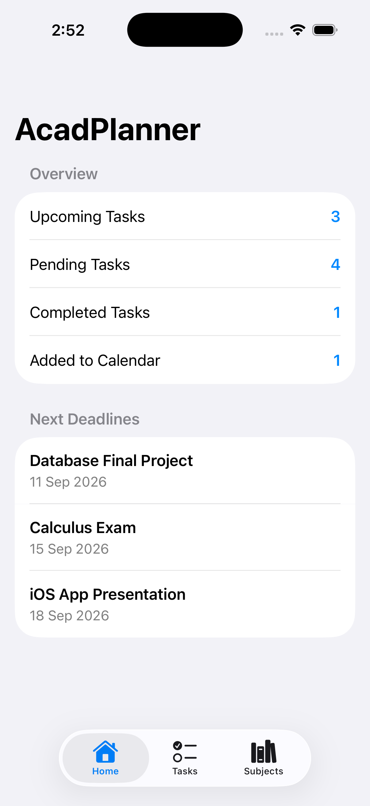
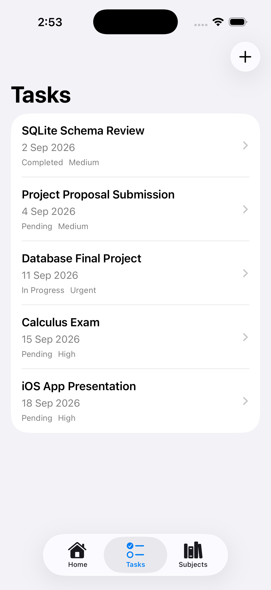
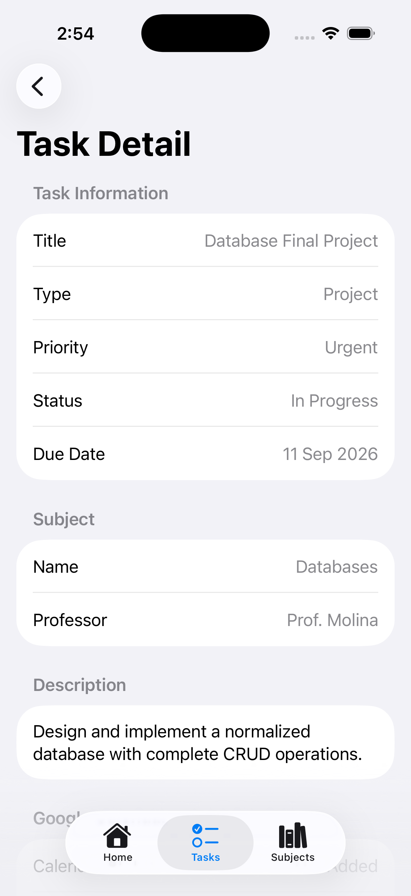
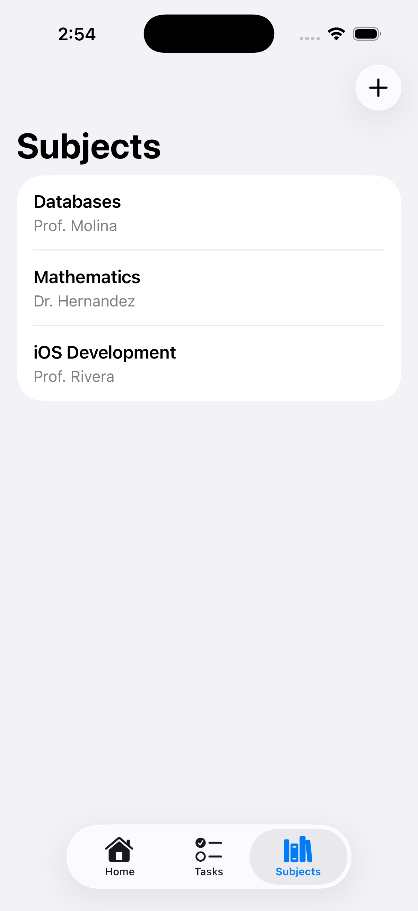
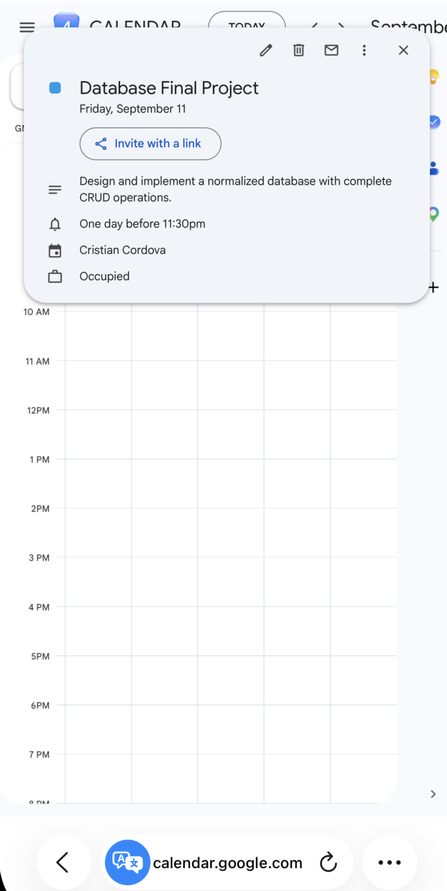

# AcadPlanner

AcadPlanner is an iOS academic task planner built with SwiftUI. It helps students organize subjects and assignments, review upcoming work, and add academic deadlines to Google Calendar.

The application follows an offline-first approach: data is stored locally with SQLite and backed up remotely with Firebase Cloud Firestore.

## Screenshots

<p align="center">
  
  
  
</p>

<p align="center">
  
  
</p>

## Features

- Create, view, update, and delete subjects.
- Create and manage academic tasks.
- Organize tasks by subject.
- Classify tasks by status, priority, and type.
- Review upcoming assignments from a dashboard.
- Store subjects and tasks locally with SQLite.
- Back up local data to Firebase Cloud Firestore.
- Authenticate users with Google Sign-In.
- Create all-day task events in Google Calendar.
- Persist calendar event identifiers and synchronization status locally and remotely.
- Continue using the core task-management features without an internet connection.

## Tech Stack

| Area | Technologies |
| --- | --- |
| Language | Swift |
| User Interface | SwiftUI |
| Architecture | MVVM, repositories, services, and data sources |
| Local Persistence | SQLite |
| Cloud Storage | Firebase Core and Cloud Firestore |
| Authentication | Google Sign-In |
| Calendar Integration | Google Calendar API |
| Dependency Management | Swift Package Manager |
| Development Tools | Xcode, Git, and GitHub |

## Architecture

AcadPlanner separates presentation, application state, data coordination, persistence, and external integrations.

```text
SwiftUI Views
      ↓
ViewModels
      ↓
Repositories
├── SQLite Data Sources ─────→ SQLite Database
├── Firebase Data Sources ───→ Cloud Firestore
└── Calendar Repository
    ├── GoogleAuthService ────→ Google Sign-In
    └── GoogleCalendarService → Google Calendar API
```

The main responsibilities of each layer are:

- **Views:** Render the interface and forward user interactions.
- **ViewModels:** Manage screen state and coordinate user actions.
- **Repositories:** Connect ViewModels with local, remote, and external data sources.
- **SQLite Data Sources:** Perform local persistence and CRUD operations.
- **Firebase Data Sources:** Back up subjects and tasks to Cloud Firestore.
- **Services:** Handle authentication and Google Calendar API communication.

## Data Flow

### Local Persistence

```text
SwiftUI View
      ↓
ViewModel
      ↓
Repository
      ↓
SQLite Data Source
      ↓
SQLite Database
```

### Firebase Backup

```text
Repository
      ↓
Firebase Data Source
      ↓
Cloud Firestore
```

### Google Calendar Integration

```text
TaskDetailView
      ↓
TaskDetailViewModel
      ↓
CalendarRepository
      ↓
GoogleAuthService
      ↓
GoogleCalendarService
      ↓
Google Calendar API
      ↓
TaskRepository
      ↓
SQLite + Cloud Firestore
```

## Offline-First Strategy

When a subject or task is created or updated, the repository saves it locally before attempting a Firebase backup.

This approach provides the following benefits:

- Core features remain available without an internet connection.
- Local operations are not blocked by network availability.
- Records maintain synchronization information.
- Firebase backup failures do not remove locally stored data.

The current MVP performs remote backups but does not provide complete bidirectional synchronization or conflict resolution.

## Firestore Collections

The application uses the following Cloud Firestore collections:

- `subjects`
- `academic_tasks`

Each document uses the record UUID as its document identifier.

## Project Structure

```text
AcadPlanner/
├── Models/
├── Views/
├── ViewModels/
├── Repositories/
├── Services/
├── DataSources/
│   ├── SQLite/
│   └── Firebase/
├── Extensions/
├── ContentView.swift
└── AcadPlannerApp.swift

docs/
├── screenshots/
│   ├── 01-home.png
│   ├── 02-tasks.png
│   ├── 03-task-detail.png
│   ├── 04-subjects.png
│   └── 05-google-calendar.png
├── mvp-scope.md
├── final-delivery-report.md
├── documentacion-acadplanner-es.md
└── Documentacion_AcadPlanner.docx
```

## Getting Started

### Requirements

To run the complete project, you need:

- macOS.
- Xcode with a compatible iOS SDK.
- An iOS simulator or physical device.
- A Firebase project configured for an iOS application.
- Cloud Firestore enabled in Firebase.
- Google Calendar API enabled in Google Cloud.
- An OAuth client configured for Google Sign-In.

### 1. Clone the Repository

```bash
git clone https://github.com/Cristian-Cordova/AcadPlanner.git
cd AcadPlanner
```

### 2. Open the Xcode Project

```bash
open AcadPlanner.xcodeproj
```

Xcode should automatically resolve the Firebase and Google Sign-In dependencies through Swift Package Manager.

### 3. Configure Firebase

1. Create or open a Firebase project.
2. Register an iOS application using the appropriate bundle identifier.
3. Enable Cloud Firestore.
4. Download `GoogleService-Info.plist`.
5. Add the file to the `AcadPlanner` target in Xcode.

Without `GoogleService-Info.plist`, local SQLite features remain available, but Firebase backup is disabled.

### 4. Configure Google Calendar

1. Open the Google Cloud project associated with the application.
2. Enable the Google Calendar API.
3. Configure the OAuth consent screen.
4. Create or configure an OAuth client for iOS.
5. Verify that the client ID in `Info.plist` matches the Google configuration.
6. Verify that the application URL scheme matches the reversed client ID.

The application requests the following Google Calendar permission:

```text
https://www.googleapis.com/auth/calendar.events
```

This scope allows the application to create calendar events without requesting access to the user's complete calendar history.

### 5. Run the Application

1. Select an iOS simulator or connected device.
2. Build the project.
3. Run AcadPlanner from Xcode.
4. Open a task and select **Add to Google Calendar** to test the calendar integration.

## Security and Configuration

`GoogleService-Info.plist` is excluded from Git and must not be committed to the public repository.

The repository must not contain:

- Access tokens.
- Refresh tokens.
- Private keys.
- Client secrets.
- Environment files.
- Personal credentials.
- Firebase service-account files.

iOS OAuth client identifiers are application configuration rather than private server secrets, but they should still be restricted to the correct bundle identifier in Google Cloud.

## Scope and Limitations

This academic MVP focuses on:

- Offline-first subject and task management.
- Firebase backup.
- One-way Google Calendar event creation.
- Local and remote calendar synchronization status.

The current version does not include:

- Bidirectional calendar synchronization.
- Reading or importing existing calendar events.
- Recurring events.
- Advanced notifications.
- Multi-user collaboration.
- Conflict resolution between local and remote records.
- App Store deployment.
- Production-grade user authentication.

## Design Decision: Google Calendar

Microsoft Graph was considered during the initial architecture phase. However, the required Microsoft Entra ID application registration and delegated calendar permissions were not available in the academic environment.

Google Calendar was selected for the final MVP because the necessary OAuth configuration was available. The repository and service architecture keeps the calendar provider separated from the SwiftUI views, allowing another provider to be implemented in the future.

## Release

The current academic MVP release is:

[AcadPlanner MVP — Final Academic Delivery](https://github.com/Cristian-Cordova/AcadPlanner/releases/tag/v1.0.0-mvp)

This release represents the final academic MVP and is not intended to be a production-ready App Store version.

## Documentation

- [Detailed MVP scope](docs/mvp-scope.md)
- [Final delivery report](docs/final-delivery-report.md)
- [Spanish academic documentation](docs/documentacion-acadplanner-es.md)
- [Spanish documentation in Word](docs/Documentacion_AcadPlanner.docx)

## Author

Developed by [Cristian Cordova](https://github.com/Cristian-Cordova) as an academic iOS development project.
